# 🎨 CSSBattle Solutions

This repository contains all my solutions for [CSSBattle](https://cssbattle.dev/) challenges.  
I will keep updating it with new challenges regularly. ✨

### Follow me on

🔗 CSSBattle: [ibrahimit](https://cssbattle.dev/player/ibrahimit)  
🔗 My GitHub: [ibraheamit](https://github.com/ibraheamit)
🔗 My LinkedIn: [ibraheamit](https://www.linkedin.com/in/ibraheamit/)

---

## 🏆 Challenges

### 📅 Daily targets

| Date       | Preview                                                            | Code                                                             | Live Demo                                                                                               |
| ---------- | ------------------------------------------------------------------ | ---------------------------------------------------------------- | ------------------------------------------------------------------------------------------------------- |
| 2026-1-28  | 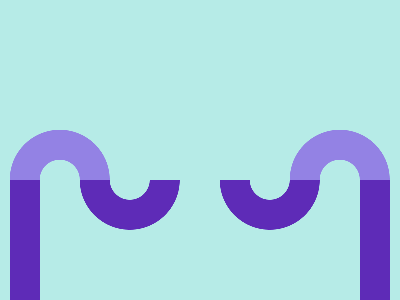  | [View Code](challenges/daily-targets/2026/2026-1-28/index.html)  | [Live Demo](https://ibraheamit.github.io/cssbattle-solutions/challenges/daily-targets/2026/2026-1-28/)  |
| 2026-1-27  | 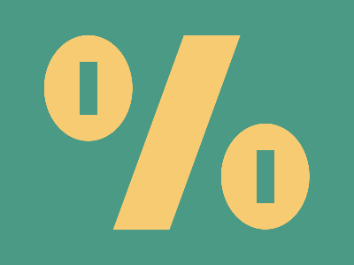  | [View Code](challenges/daily-targets/2026/2026-1-27/index.html)  | [Live Demo](https://ibraheamit.github.io/cssbattle-solutions/challenges/daily-targets/2026/2026-1-27/)  |
| 2026-1-26  | 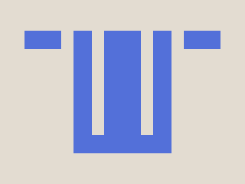  | [View Code](challenges/daily-targets/2026/2026-1-26/index.html)  | [Live Demo](https://ibraheamit.github.io/cssbattle-solutions/challenges/daily-targets/2026/2026-1-26/)  |
| 2026-1-25  |   | [View Code](challenges/daily-targets/2026/2026-1-25/index.html)  | [Live Demo](https://ibraheamit.github.io/cssbattle-solutions/challenges/daily-targets/2026/2026-1-25/)  |
| 2026-1-24  |   | [View Code](challenges/daily-targets/2026/2026-1-24/index.html)  | [Live Demo](https://ibraheamit.github.io/cssbattle-solutions/challenges/daily-targets/2026/2026-1-24/)  |
| 2026-1-23  | 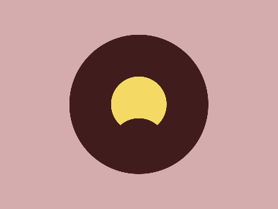  | [View Code](challenges/daily-targets/2026/2026-1-23/index.html)  | [Live Demo](https://ibraheamit.github.io/cssbattle-solutions/challenges/daily-targets/2026/2026-1-23/)  |
| 2026-1-22  |   | [View Code](challenges/daily-targets/2026/2026-1-22/index.html)  | [Live Demo](https://ibraheamit.github.io/cssbattle-solutions/challenges/daily-targets/2026/2026-1-22/)  |
| 2026-1-21  |   | [View Code](challenges/daily-targets/2026/2026-1-21/index.html)  | [Live Demo](https://ibraheamit.github.io/cssbattle-solutions/challenges/daily-targets/2026/2026-1-21/)  |
| 2026-1-20  |   | [View Code](challenges/daily-targets/2026/2026-1-20/index.html)  | [Live Demo](https://ibraheamit.github.io/cssbattle-solutions/challenges/daily-targets/2026/2026-1-20/)  |
| 2026-1-19  | 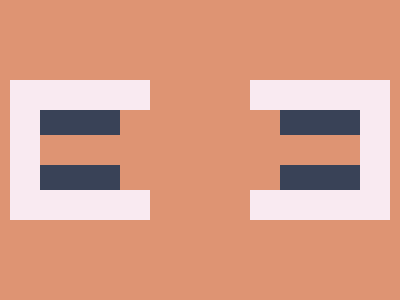  | [View Code](challenges/daily-targets/2026/2026-1-19/index.html)  | [Live Demo](https://ibraheamit.github.io/cssbattle-solutions/challenges/daily-targets/2026/2026-1-19/)  |
| 2026-1-18  |   | [View Code](challenges/daily-targets/2026/2026-1-18/index.html)  | [Live Demo](https://ibraheamit.github.io/cssbattle-solutions/challenges/daily-targets/2026/2026-1-18/)  |
| 2026-1-17  |   | [View Code](challenges/daily-targets/2026/2026-1-17/index.html)  | [Live Demo](https://ibraheamit.github.io/cssbattle-solutions/challenges/daily-targets/2026/2026-1-17/)  |
| 2026-1-16  |   | [View Code](challenges/daily-targets/2026/2026-1-16/index.html)  | [Live Demo](https://ibraheamit.github.io/cssbattle-solutions/challenges/daily-targets/2026/2026-1-16/)  |
| 2026-1-15  | 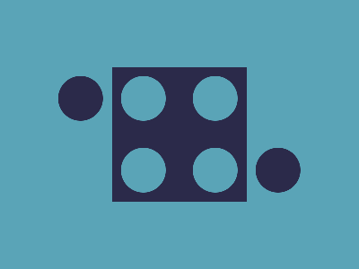  | [View Code](challenges/daily-targets/2026/2026-1-15/index.html)  | [Live Demo](https://ibraheamit.github.io/cssbattle-solutions/challenges/daily-targets/2026/2026-1-15/)  |
| 2026-1-14  | 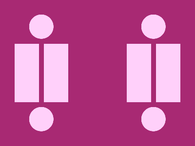  | [View Code](challenges/daily-targets/2026/2026-1-14/index.html)  | [Live Demo](https://ibraheamit.github.io/cssbattle-solutions/challenges/daily-targets/2026/2026-1-14/)  |
| 2026-1-13  |   | [View Code](challenges/daily-targets/2026/2026-1-13/index.html)  | [Live Demo](https://ibraheamit.github.io/cssbattle-solutions/challenges/daily-targets/2026/2026-1-13/)  |
| 2026-1-12  |   | [View Code](challenges/daily-targets/2026/2026-1-12/index.html)  | [Live Demo](https://ibraheamit.github.io/cssbattle-solutions/challenges/daily-targets/2026/2026-1-12/)  |
| 2026-1-11  | 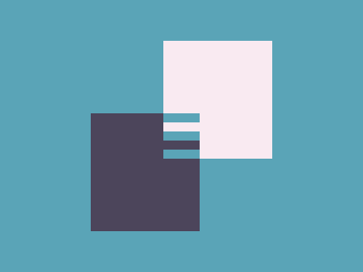  | [View Code](challenges/daily-targets/2026/2026-1-11/index.html)  | [Live Demo](https://ibraheamit.github.io/cssbattle-solutions/challenges/daily-targets/2026/2026-1-11/)  |
| 2026-1-10  |   | [View Code](challenges/daily-targets/2026/2026-1-10/index.html)  | [Live Demo](https://ibraheamit.github.io/cssbattle-solutions/challenges/daily-targets/2026/2026-1-10/)  |
| 2026-1-9   |    | [View Code](challenges/daily-targets/2026/2026-1-9/index.html)   | [Live Demo](https://ibraheamit.github.io/cssbattle-solutions/challenges/daily-targets/2026/2026-1-9/)   |
| 2026-1-8   | 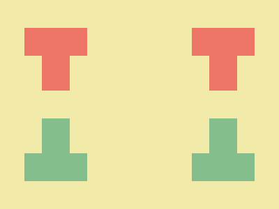   | [View Code](challenges/daily-targets/2026/2026-1-8/index.html)   | [Live Demo](https://ibraheamit.github.io/cssbattle-solutions/challenges/daily-targets/2026/2026-1-8/)   |
| 2026-1-7   |    | [View Code](challenges/daily-targets/2026/2026-1-7/index.html)   | [Live Demo](https://ibraheamit.github.io/cssbattle-solutions/challenges/daily-targets/2026/2026-1-7/)   |
| 2026-1-6   | 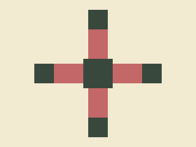   | [View Code](challenges/daily-targets/2026/2026-1-6/index.html)   | [Live Demo](https://ibraheamit.github.io/cssbattle-solutions/challenges/daily-targets/2026/2026-1-6/)   |
| 2026-1-5   | 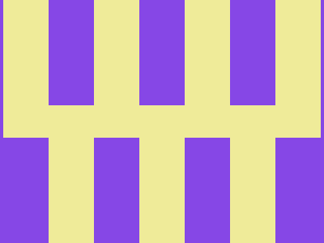   | [View Code](challenges/daily-targets/2026/2026-1-5/index.html)   | [Live Demo](https://ibraheamit.github.io/cssbattle-solutions/challenges/daily-targets/2026/2026-1-5/)   |
| 2026-1-4   | 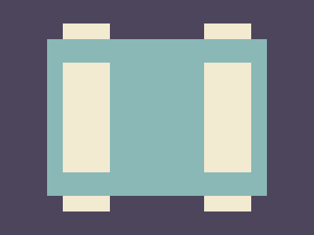   | [View Code](challenges/daily-targets/2026/2026-1-4/index.html)   | [Live Demo](https://ibraheamit.github.io/cssbattle-solutions/challenges/daily-targets/2026/2026-1-4/)   |
| 2026-1-3   | 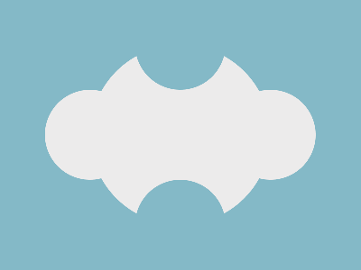   | [View Code](challenges/daily-targets/2026/2026-1-3/index.html)   | [Live Demo](https://ibraheamit.github.io/cssbattle-solutions/challenges/daily-targets/2026/2026-1-3/)   |
| 2026-1-2   |    | [View Code](challenges/daily-targets/2026/2026-1-2/index.html)   | [Live Demo](https://ibraheamit.github.io/cssbattle-solutions/challenges/daily-targets/2026/2026-1-2/)   |
| 2026-1-1   |    | [View Code](challenges/daily-targets/2026/2026-1-1/index.html)   | [Live Demo](https://ibraheamit.github.io/cssbattle-solutions/challenges/daily-targets/2026/2026-1-1/)   |
| 2025-12-31 | 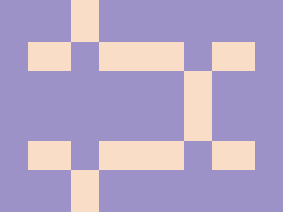 | [View Code](challenges/daily-targets/2025/2025-12-31/index.html) | [Live Demo](https://ibraheamit.github.io/cssbattle-solutions/challenges/daily-targets/2025/2025-12-31/) |
| 2025-12-30 |  | [View Code](challenges/daily-targets/2025/2025-12-30/index.html) | [Live Demo](https://ibraheamit.github.io/cssbattle-solutions/challenges/daily-targets/2025/2025-12-30/) |
| 2025-12-29 | 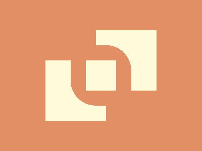 | [View Code](challenges/daily-targets/2025/2025-12-29/index.html) | [Live Demo](https://ibraheamit.github.io/cssbattle-solutions/challenges/daily-targets/2025/2025-12-29/) |
| 2025-12-28 |  | [View Code](challenges/daily-targets/2025/2025-12-28/index.html) | [Live Demo](https://ibraheamit.github.io/cssbattle-solutions/challenges/daily-targets/2025/2025-12-28/) |
| 2025-12-27 |  | [View Code](challenges/daily-targets/2025/2025-12-27/index.html) | [Live Demo](https://ibraheamit.github.io/cssbattle-solutions/challenges/daily-targets/2025/2025-12-27/) |
| 2025-12-26 |  | [View Code](challenges/daily-targets/2025/2025-12-26/index.html) | [Live Demo](https://ibraheamit.github.io/cssbattle-solutions/challenges/daily-targets/2025/2025-12-26/) |
| 2025-12-25 |  | [View Code](challenges/daily-targets/2025/2025-12-25/index.html) | [Live Demo](https://ibraheamit.github.io/cssbattle-solutions/challenges/daily-targets/2025/2025-12-25/) |
| 2025-12-24 |  | [View Code](challenges/daily-targets/2025/2025-12-24/index.html) | [Live Demo](https://ibraheamit.github.io/cssbattle-solutions/challenges/daily-targets/2025/2025-12-24/) |
| 2025-12-23 | 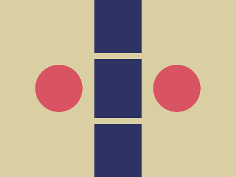 | [View Code](challenges/daily-targets/2025/2025-12-23/index.html) | [Live Demo](https://ibraheamit.github.io/cssbattle-solutions/challenges/daily-targets/2025/2025-12-23/) |
| 2025-12-22 | 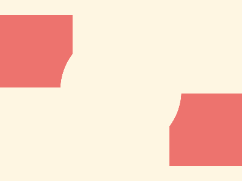 | [View Code](challenges/daily-targets/2025/2025-12-22/index.html) | [Live Demo](https://ibraheamit.github.io/cssbattle-solutions/challenges/daily-targets/2025/2025-12-22/) |
| 2025-12-21 |  | [View Code](challenges/daily-targets/2025/2025-12-21/index.html) | [Live Demo](https://ibraheamit.github.io/cssbattle-solutions/challenges/daily-targets/2025/2025-12-21/) |
| 2025-12-20 |  | [View Code](challenges/daily-targets/2025/2025-12-20/index.html) | [Live Demo](https://ibraheamit.github.io/cssbattle-solutions/challenges/daily-targets/2025/2025-12-20/) |
| 2025-12-19 | 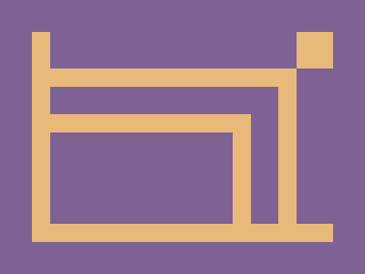 | [View Code](challenges/daily-targets/2025/2025-12-19/index.html) | [Live Demo](https://ibraheamit.github.io/cssbattle-solutions/challenges/daily-targets/2025/2025-12-19/) |
| 2025-12-18 | 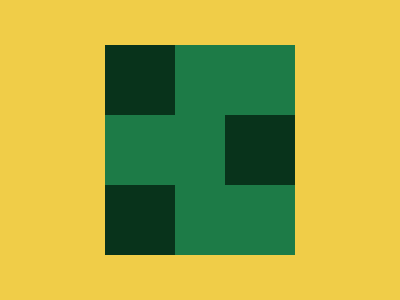 | [View Code](challenges/daily-targets/2025/2025-12-18/index.html) | [Live Demo](https://ibraheamit.github.io/cssbattle-solutions/challenges/daily-targets/2025/2025-12-18/) |
| 2025-12-17 |  | [View Code](challenges/daily-targets/2025/2025-12-17/index.html) | [Live Demo](https://ibraheamit.github.io/cssbattle-solutions/challenges/daily-targets/2025/2025-12-17/) |
| 2025-12-16 | 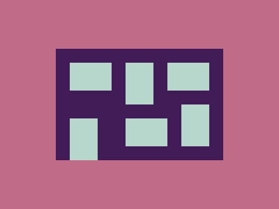 | [View Code](challenges/daily-targets/2025/2025-12-16/index.html) | [Live Demo](https://ibraheamit.github.io/cssbattle-solutions/challenges/daily-targets/2025/2025-12-16/) |
| 2025-12-15 |  | [View Code](challenges/daily-targets/2025/2025-12-15/index.html) | [Live Demo](https://ibraheamit.github.io/cssbattle-solutions/challenges/daily-targets/2025/2025-12-15/) |
| 2025-12-14 |  | [View Code](challenges/daily-targets/2025/2025-12-14/index.html) | [Live Demo](https://ibraheamit.github.io/cssbattle-solutions/challenges/daily-targets/2025/2025-12-14/) |
| 2025-12-13 | 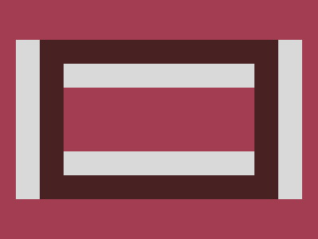 | [View Code](challenges/daily-targets/2025/2025-12-13/index.html) | [Live Demo](https://ibraheamit.github.io/cssbattle-solutions/challenges/daily-targets/2025/2025-12-13/) |
| 2025-12-12 | 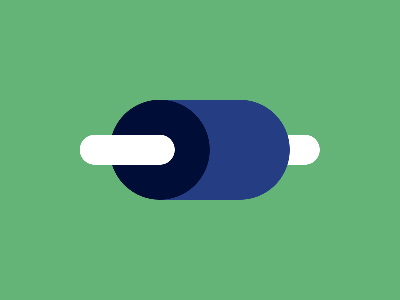 | [View Code](challenges/daily-targets/2025/2025-12-12/index.html) | [Live Demo](https://ibraheamit.github.io/cssbattle-solutions/challenges/daily-targets/2025/2025-12-12/) |
| 2025-12-11 |  | [View Code](challenges/daily-targets/2025/2025-12-11/index.html) | [Live Demo](https://ibraheamit.github.io/cssbattle-solutions/challenges/daily-targets/2025/2025-12-11/) |
| 2025-12-10 | 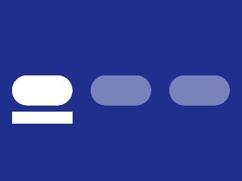 | [View Code](challenges/daily-targets/2025/2025-12-10/index.html) | [Live Demo](https://ibraheamit.github.io/cssbattle-solutions/challenges/daily-targets/2025/2025-12-10/) |
| 2025-12-9  |   | [View Code](challenges/daily-targets/2025/2025-12-9/index.html)  | [Live Demo](https://ibraheamit.github.io/cssbattle-solutions/challenges/daily-targets/2025/2025-12-9/)  |
| 2025-12-8  |   | [View Code](challenges/daily-targets/2025/2025-12-8/index.html)  | [Live Demo](https://ibraheamit.github.io/cssbattle-solutions/challenges/daily-targets/2025/2025-12-8/)  |
| 2025-12-7  | 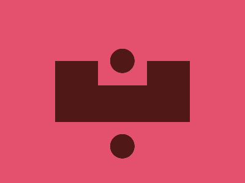  | [View Code](challenges/daily-targets/2025/2025-12-7/index.html)  | [Live Demo](https://ibraheamit.github.io/cssbattle-solutions/challenges/daily-targets/2025/2025-12-7/)  |
| 2025-12-6  |   | [View Code](challenges/daily-targets/2025/2025-12-6/index.html)  | [Live Demo](https://ibraheamit.github.io/cssbattle-solutions/challenges/daily-targets/2025/2025-12-6/)  |
| 2025-12-5  |   | [View Code](challenges/daily-targets/2025/2025-12-5/index.html)  | [Live Demo](https://ibraheamit.github.io/cssbattle-solutions/challenges/daily-targets/2025/2025-12-5/)  |
| 2025-12-4  |   | [View Code](challenges/daily-targets/2025/2025-12-4/index.html)  | [Live Demo](https://ibraheamit.github.io/cssbattle-solutions/challenges/daily-targets/2025/2025-12-4/)  |
| 2025-12-3  |   | [View Code](challenges/daily-targets/2025/2025-12-3/index.html)  | [Live Demo](https://ibraheamit.github.io/cssbattle-solutions/challenges/daily-targets/2025/2025-12-3/)  |
| 2025-12-2  | 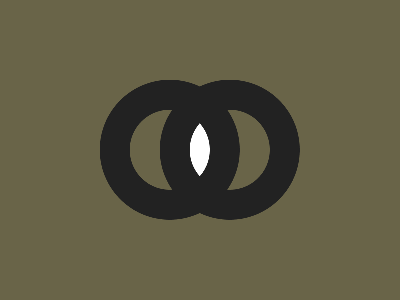  | [View Code](challenges/daily-targets/2025/2025-12-2/index.html)  | [Live Demo](https://ibraheamit.github.io/cssbattle-solutions/challenges/daily-targets/2025/2025-12-2/)  |
| 2025-12-1  |   | [View Code](challenges/daily-targets/2025/2025-12-1/index.html)  | [Live Demo](https://ibraheamit.github.io/cssbattle-solutions/challenges/daily-targets/2025/2025-12-1/)  |
| 2025-11-30 | 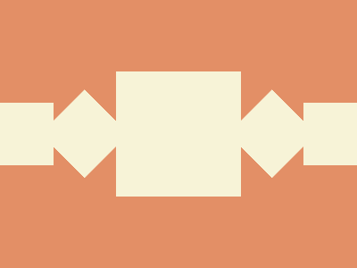 | [View Code](challenges/daily-targets/2025/2025-11-30/index.html) | [Live Demo](https://ibraheamit.github.io/cssbattle-solutions/challenges/daily-targets/2025/2025-11-30/) |
| 2025-11-29 | 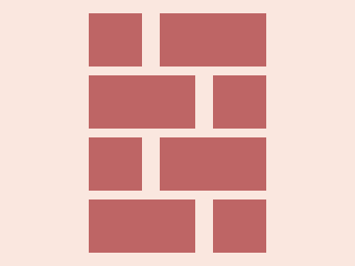 | [View Code](challenges/daily-targets/2025/2025-11-29/index.html) | [Live Demo](https://ibraheamit.github.io/cssbattle-solutions/challenges/daily-targets/2025/2025-11-29/) |
| 2025-11-28 |  | [View Code](challenges/daily-targets/2025/2025-11-28/index.html) | [Live Demo](https://ibraheamit.github.io/cssbattle-solutions/challenges/daily-targets/2025/2025-11-28/) |
| 2025-11-27 | 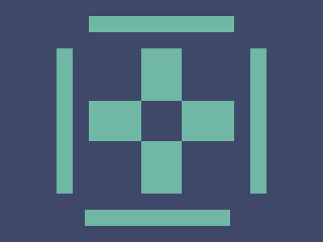 | [View Code](challenges/daily-targets/2025/2025-11-27/index.html) | [Live Demo](https://ibraheamit.github.io/cssbattle-solutions/challenges/daily-targets/2025/2025-11-27/) |
| 2025-11-26 |  | [View Code](challenges/daily-targets/2025/2025-11-26/index.html) | [Live Demo](https://ibraheamit.github.io/cssbattle-solutions/challenges/daily-targets/2025/2025-11-26/) |
| 2025-11-25 |  | [View Code](challenges/daily-targets/2025/2025-11-25/index.html) | [Live Demo](https://ibraheamit.github.io/cssbattle-solutions/challenges/daily-targets/2025/2025-11-25/) |
| 2025-11-24 | 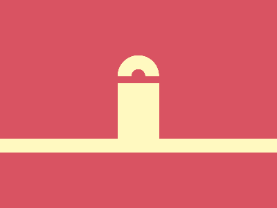 | [View Code](challenges/daily-targets/2025/2025-11-24/index.html) | [Live Demo](https://ibraheamit.github.io/cssbattle-solutions/challenges/daily-targets/2025/2025-11-24/) |
| 2025-11-23 | 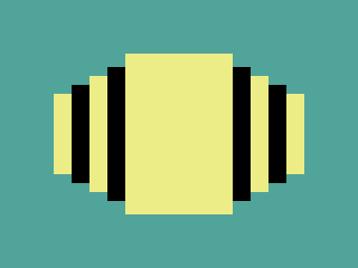 | [View Code](challenges/daily-targets/2025/2025-11-23/index.html) | [Live Demo](https://ibraheamit.github.io/cssbattle-solutions/challenges/daily-targets/2025/2025-11-23/) |
| 2025-11-22 | 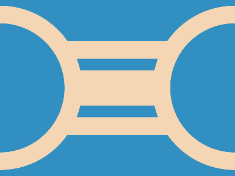 | [View Code](challenges/daily-targets/2025/2025-11-22/index.html) | [Live Demo](https://ibraheamit.github.io/cssbattle-solutions/challenges/daily-targets/2025/2025-11-22/) |
| 2025-11-21 |  | [View Code](challenges/daily-targets/2025/2025-11-21/index.html) | [Live Demo](https://ibraheamit.github.io/cssbattle-solutions/challenges/daily-targets/2025/2025-11-21/) |
| 2025-11-20 | 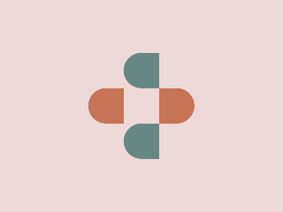 | [View Code](challenges/daily-targets/2025/2025-11-20/index.html) | [Live Demo](https://ibraheamit.github.io/cssbattle-solutions/challenges/daily-targets/2025/2025-11-20/) |
| 2025-11-19 |  | [View Code](challenges/daily-targets/2025/2025-11-19/index.html) | [Live Demo](https://ibraheamit.github.io/cssbattle-solutions/challenges/daily-targets/2025/2025-11-19/) |
| 2025-11-18 |  | [View Code](challenges/daily-targets/2025/2025-11-18/index.html) | [Live Demo](https://ibraheamit.github.io/cssbattle-solutions/challenges/daily-targets/2025/2025-11-18/) |
| 2025-11-17 |  | [View Code](challenges/daily-targets/2025/2025-11-17/index.html) | [Live Demo](https://ibraheamit.github.io/cssbattle-solutions/challenges/daily-targets/2025/2025-11-17/) |
| 2025-11-16 |  | [View Code](challenges/daily-targets/2025/2025-11-16/index.html) | [Live Demo](https://ibraheamit.github.io/cssbattle-solutions/challenges/daily-targets/2025/2025-11-16/) |
| 2025-11-15 |  | [View Code](challenges/daily-targets/2025/2025-11-15/index.html) | [Live Demo](https://ibraheamit.github.io/cssbattle-solutions/challenges/daily-targets/2025/2025-11-15/) |
| 2025-11-14 |  | [View Code](challenges/daily-targets/2025/2025-11-14/index.html) | [Live Demo](https://ibraheamit.github.io/cssbattle-solutions/challenges/daily-targets/2025/2025-11-14/) |
| 2025-11-13 | 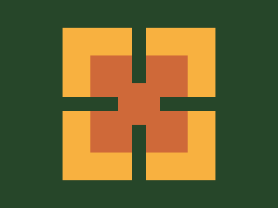 | [View Code](challenges/daily-targets/2025/2025-11-13/index.html) | [Live Demo](https://ibraheamit.github.io/cssbattle-solutions/challenges/daily-targets/2025/2025-11-13/) |
| 2025-11-12 | 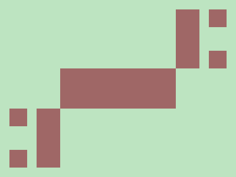 | [View Code](challenges/daily-targets/2025/2025-11-12/index.html) | [Live Demo](https://ibraheamit.github.io/cssbattle-solutions/challenges/daily-targets/2025/2025-11-12/) |
| 2025-11-11 |  | [View Code](challenges/daily-targets/2025/2025-11-11/index.html) | [Live Demo](https://ibraheamit.github.io/cssbattle-solutions/challenges/daily-targets/2025/2025-11-11/) |
| 2025-11-10 | 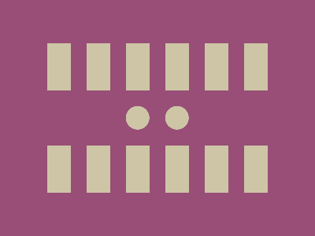 | [View Code](challenges/daily-targets/2025/2025-11-10/index.html) | [Live Demo](https://ibraheamit.github.io/cssbattle-solutions/challenges/daily-targets/2025/2025-11-10/) |
| 2025-11-9  |   | [View Code](challenges/daily-targets/2025/2025-11-9/index.html)  | [Live Demo](https://ibraheamit.github.io/cssbattle-solutions/challenges/daily-targets/2025/2025-11-9/)  |
| 2025-11-8  |   | [View Code](challenges/daily-targets/2025/2025-11-8/index.html)  | [Live Demo](https://ibraheamit.github.io/cssbattle-solutions/challenges/daily-targets/2025/2025-11-8/)  |
| 2025-11-7  | 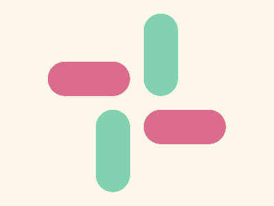  | [View Code](challenges/daily-targets/2025/2025-11-7/index.html)  | [Live Demo](https://ibraheamit.github.io/cssbattle-solutions/challenges/daily-targets/2025/2025-11-7/)  |
| 2025-11-6  |   | [View Code](challenges/daily-targets/2025/2025-11-6/index.html)  | [Live Demo](https://ibraheamit.github.io/cssbattle-solutions/challenges/daily-targets/2025/2025-11-6/)  |
| 2025-11-5  | 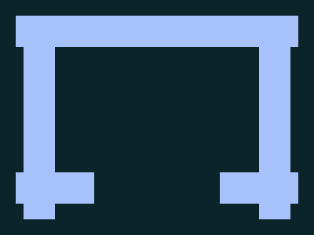  | [View Code](challenges/daily-targets/2025/2025-11-5/index.html)  | [Live Demo](https://ibraheamit.github.io/cssbattle-solutions/challenges/daily-targets/2025/2025-11-5/)  |
| 2025-11-4  | 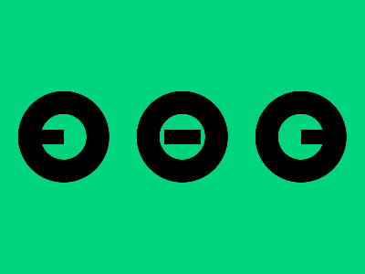  | [View Code](challenges/daily-targets/2025/2025-11-4/index.html)  | [Live Demo](https://ibraheamit.github.io/cssbattle-solutions/challenges/daily-targets/2025/2025-11-4/)  |
| 2025-11-3  |   | [View Code](challenges/daily-targets/2025/2025-11-3/index.html)  | [Live Demo](https://ibraheamit.github.io/cssbattle-solutions/challenges/daily-targets/2025/2025-11-3/)  |
| 2025-11-2  |   | [View Code](challenges/daily-targets/2025/2025-11-2/index.html)  | [Live Demo](https://ibraheamit.github.io/cssbattle-solutions/challenges/daily-targets/2025/2025-11-2/)  |
| 2025-11-1  |   | [View Code](challenges/daily-targets/2025/2025-11-1/index.html)  | [Live Demo](https://ibraheamit.github.io/cssbattle-solutions/challenges/daily-targets/2025/2025-11-1/)  |
| 2025-10-31 |  | [View Code](challenges/daily-targets/2025/2025-10-31/index.html) | [Live Demo](https://ibraheamit.github.io/cssbattle-solutions/challenges/daily-targets/2025/2025-10-31/) |
| 2025-10-30 |  | [View Code](challenges/daily-targets/2025/2025-10-30/index.html) | [Live Demo](https://ibraheamit.github.io/cssbattle-solutions/challenges/daily-targets/2025/2025-10-30/) |
| 2025-10-29 |  | [View Code](challenges/daily-targets/2025/2025-10-29/index.html) | [Live Demo](https://ibraheamit.github.io/cssbattle-solutions/challenges/daily-targets/2025/2025-10-29/) |
| 2025-10-28 | 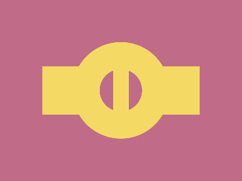 | [View Code](challenges/daily-targets/2025/2025-10-28/index.html) | [Live Demo](https://ibraheamit.github.io/cssbattle-solutions/challenges/daily-targets/2025/2025-10-28/) |
| 2025-10-27 | 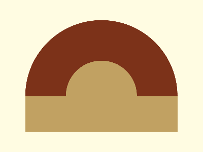 | [View Code](challenges/daily-targets/2025/2025-10-27/index.html) | [Live Demo](https://ibraheamit.github.io/cssbattle-solutions/challenges/daily-targets/2025/2025-10-27/) |
| 2025-10-26 |  | [View Code](challenges/daily-targets/2025/2025-10-26/index.html) | [Live Demo](https://ibraheamit.github.io/cssbattle-solutions/challenges/daily-targets/2025/2025-10-26/) |
| 2025-10-25 |  | [View Code](challenges/daily-targets/2025/2025-10-25/index.html) | [Live Demo](https://ibraheamit.github.io/cssbattle-solutions/challenges/daily-targets/2025/2025-10-25/) |
| 2025-10-24 | 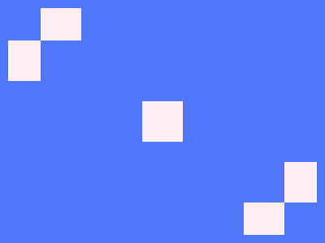 | [View Code](challenges/daily-targets/2025/2025-10-24/index.html) | [Live Demo](https://ibraheamit.github.io/cssbattle-solutions/challenges/daily-targets/2025/2025-10-24/) |
| 2025-10-23 |  | [View Code](challenges/daily-targets/2025/2025-10-23/index.html) | [Live Demo](https://ibraheamit.github.io/cssbattle-solutions/challenges/daily-targets/2025/2025-10-23/) |
| 2025-10-22 |  | [View Code](challenges/daily-targets/2025/2025-10-22/index.html) | [Live Demo](https://ibraheamit.github.io/cssbattle-solutions/challenges/daily-targets/2025/2025-10-22/) |
| 2025-10-21 |  | [View Code](challenges/daily-targets/2025/2025-10-21/index.html) | [Live Demo](https://ibraheamit.github.io/cssbattle-solutions/challenges/daily-targets/2025/2025-10-21/) |
| 2025-10-20 |  | [View Code](challenges/daily-targets/2025/2025-10-20/index.html) | [Live Demo](https://ibraheamit.github.io/cssbattle-solutions/challenges/daily-targets/2025/2025-10-20/) |
| 2025-10-19 |  | [View Code](challenges/daily-targets/2025/2025-10-19/index.html) | [Live Demo](https://ibraheamit.github.io/cssbattle-solutions/challenges/daily-targets/2025/2025-10-19/) |
| 2025-10-18 | 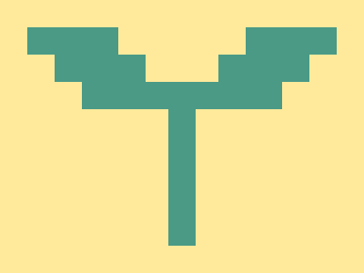 | [View Code](challenges/daily-targets/2025/2025-10-18/index.html) | [Live Demo](https://ibraheamit.github.io/cssbattle-solutions/challenges/daily-targets/2025/2025-10-18/) |
| 2025-10-17 |  | [View Code](challenges/daily-targets/2025/2025-10-17/index.html) | [Live Demo](https://ibraheamit.github.io/cssbattle-solutions/challenges/daily-targets/2025/2025-10-17/) |
| 2025-10-16 |  | [View Code](challenges/daily-targets/2025/2025-10-16/index.html) | [Live Demo](https://ibraheamit.github.io/cssbattle-solutions/challenges/daily-targets/2025/2025-10-16/) |
| 2025-10-15 | 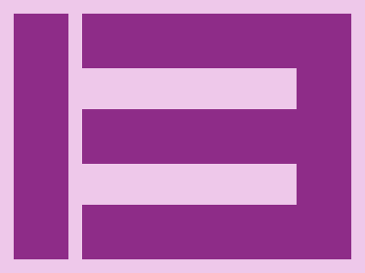 | [View Code](challenges/daily-targets/2025/2025-10-15/index.html) | [Live Demo](https://ibraheamit.github.io/cssbattle-solutions/challenges/daily-targets/2025/2025-10-15/) |
| 2025-10-14 |  | [View Code](challenges/daily-targets/2025/2025-10-14/index.html) | [Live Demo](https://ibraheamit.github.io/cssbattle-solutions/challenges/daily-targets/2025/2025-10-14/) |
| 2025-10-13 | 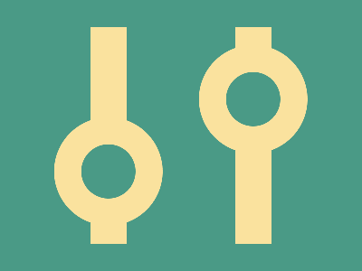 | [View Code](challenges/daily-targets/2025/2025-10-13/index.html) | [Live Demo](https://ibraheamit.github.io/cssbattle-solutions/challenges/daily-targets/2025/2025-10-13/) |
| 2025-10-12 |  | [View Code](challenges/daily-targets/2025/2025-10-12/index.html) | [Live Demo](https://ibraheamit.github.io/cssbattle-solutions/challenges/daily-targets/2025/2025-10-12/) |
| 2025-10-11 |  | [View Code](challenges/daily-targets/2025/2025-10-11/index.html) | [Live Demo](https://ibraheamit.github.io/cssbattle-solutions/challenges/daily-targets/2025/2025-10-11/) |
| 2025-10-10 | 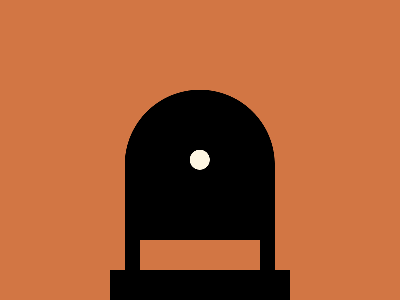 | [View Code](challenges/daily-targets/2025/2025-10-10/index.html) | [Live Demo](https://ibraheamit.github.io/cssbattle-solutions/challenges/daily-targets/2025/2025-10-10/) |
| 2025-10-9  |   | [View Code](challenges/daily-targets/2025/2025-10-9/index.html)  | [Live Demo](https://ibraheamit.github.io/cssbattle-solutions/challenges/daily-targets/2025/2025-10-9/)  |
| 2025-10-8  | 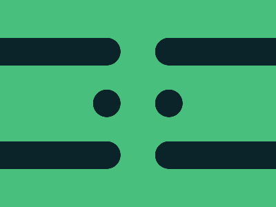  | [View Code](challenges/daily-targets/2025/2025-10-8/index.html)  | [Live Demo](https://ibraheamit.github.io/cssbattle-solutions/challenges/daily-targets/2025/2025-10-8/)  |
| 2025-10-7  |   | [View Code](challenges/daily-targets/2025/2025-10-7/index.html)  | [Live Demo](https://ibraheamit.github.io/cssbattle-solutions/challenges/daily-targets/2025/2025-10-7/)  |
| 2025-10-6  |   | [View Code](challenges/daily-targets/2025/2025-10-6/index.html)  | [Live Demo](https://ibraheamit.github.io/cssbattle-solutions/challenges/daily-targets/2025/2025-10-6/)  |
| 2025-10-5  |   | [View Code](challenges/daily-targets/2025/2025-10-5/index.html)  | [Live Demo](https://ibraheamit.github.io/cssbattle-solutions/challenges/daily-targets/2025/2025-10-5/)  |
| 2025-10-4  |   | [View Code](challenges/daily-targets/2025/2025-10-4/index.html)  | [Live Demo](https://ibraheamit.github.io/cssbattle-solutions/challenges/daily-targets/2025/2025-10-4/)  |
| 2025-10-3  | 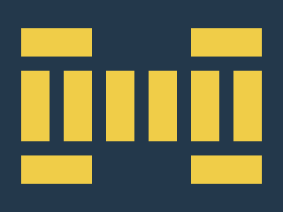  | [View Code](challenges/daily-targets/2025/2025-10-3/index.html)  | [Live Demo](https://ibraheamit.github.io/cssbattle-solutions/challenges/daily-targets/2025/2025-10-3/)  |
| 2025-10-2  |   | [View Code](challenges/daily-targets/2025/2025-10-2/index.html)  | [Live Demo](https://ibraheamit.github.io/cssbattle-solutions/challenges/daily-targets/2025/2025-10-2/)  |
| 2025-10-1  |   | [View Code](challenges/daily-targets/2025/2025-10-1/index.html)  | [Live Demo](https://ibraheamit.github.io/cssbattle-solutions/challenges/daily-targets/2025/2025-10-1/)  |
| 2025-09-30 | 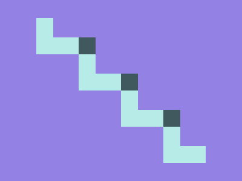 | [View Code](challenges/daily-targets/2025/2025-09-30/index.html) | [Live Demo](https://ibraheamit.github.io/cssbattle-solutions/challenges/daily-targets/2025/2025-09-30/) |
| 2025-09-29 |  | [View Code](challenges/daily-targets/2025/2025-09-29/index.html) | [Live Demo](https://ibraheamit.github.io/cssbattle-solutions/challenges/daily-targets/2025/2025-09-29/) |
| 2025-09-28 | 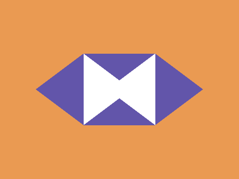 | [View Code](challenges/daily-targets/2025/2025-09-28/index.html) | [Live Demo](https://ibraheamit.github.io/cssbattle-solutions/challenges/daily-targets/2025/2025-09-28/) |
| 2025-09-27 |  | [View Code](challenges/daily-targets/2025/2025-09-27/index.html) | [Live Demo](https://ibraheamit.github.io/cssbattle-solutions/challenges/daily-targets/2025/2025-09-27/) |
| 2025-09-26 |  | [View Code](challenges/daily-targets/2025/2025-09-26/index.html) | [Live Demo](https://ibraheamit.github.io/cssbattle-solutions/challenges/daily-targets/2025/2025-09-26/) |
| 2025-09-25 | 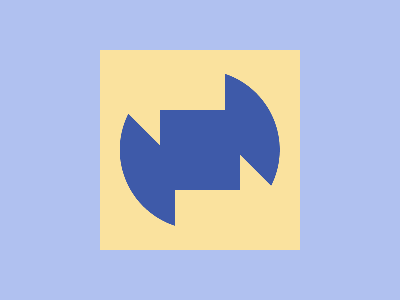 | [View Code](challenges/daily-targets/2025/2025-09-25/index.html) | [live Demo](https://ibraheamit.github.io/cssbattle-solutions/challenges/daily-targets/2025/2025-09-25/) |
| 2025-09-24 |  | [View Code](challenges/daily-targets/2025/2025-09-24/index.html) | [Live Demo](https://ibraheamit.github.io/cssbattle-solutions/challenges/daily-targets/2025/2025-09-24/) |
| 2025-09-23 |  | [View Code](challenges/daily-targets/2025/2025-09-23/index.html) | [Live Demo](https://ibraheamit.github.io/cssbattle-solutions/challenges/daily-targets/2025/2025-09-23/) |
| 2025-09-22 | 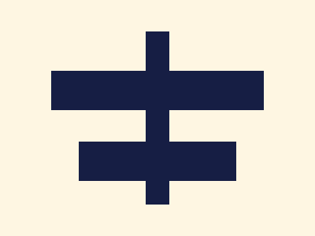 | [View Code](challenges/daily-targets/2025/2025-09-22/index.html) | [Live Demo](https://ibraheamit.github.io/cssbattle-solutions/challenges/daily-targets/2025/2025-09-22/) |
| 2025-09-21 |  | [View Code](challenges/daily-targets/2025/2025-09-21/index.html) | [Live Demo](https://ibraheamit.github.io/cssbattle-solutions/challenges/daily-targets/2025/2025-09-21/) |
| 2025-09-20 |  | [View Code](challenges/daily-targets/2025/2025-09-20/index.html) | [Live Demo](https://ibraheamit.github.io/cssbattle-solutions/challenges/daily-targets/2025/2025-09-20/) |
| 2025-09-19 |  | [View Code](challenges/daily-targets/2025/2025-09-19/index.html) | [Live Demo](https://ibraheamit.github.io/cssbattle-solutions/challenges/daily-targets/2025/2025-09-19/) |
| 2025-09-18 |  | [View Code](challenges/daily-targets/2025/2025-09-18/index.html) | [Live Demo](https://ibraheamit.github.io/cssbattle-solutions/challenges/daily-targets/2025/2025-09-18/) |
| 2025-09-17 |  | [View Code](challenges/daily-targets/2025/2025-09-17/index.html) | [Live Demo](https://ibraheamit.github.io/cssbattle-solutions/challenges/daily-targets/2025/2025-09-17/) |
| 2025-09-16 |  | [View Code](challenges/daily-targets/2025/2025-09-16/index.html) | [Live Demo](https://ibraheamit.github.io/cssbattle-solutions/challenges/daily-targets/2025/2025-09-16/) |
| 2025-09-15 |  | [View Code](challenges/daily-targets/2025/2025-09-15/index.html) | [Live Demo](https://ibraheamit.github.io/cssbattle-solutions/challenges/daily-targets/2025/2025-09-15/) |

### ⚔️ Battles

| Number | Preview                                                   | Code                                                         | Live Demo                                                                                           |
| ------ | --------------------------------------------------------- | ------------------------------------------------------------ | --------------------------------------------------------------------------------------------------- |
| #136   |       | [View Code](challenges/Battles/22-Grid/136/index.html)       | [Live Demo](https://ibraheamit.github.io/cssbattle-solutions/challenges/Battles/22-Grid/136/)       |
| #135   | 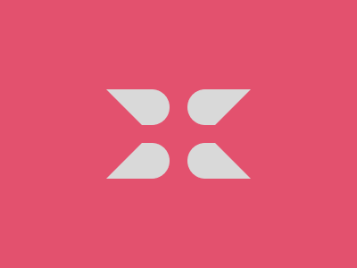      | [View Code](challenges/Battles/22-Grid/135/index.html)       | [Live Demo](https://ibraheamit.github.io/cssbattle-solutions/challenges/Battles/22-Grid/135/)       |
| #134   |       | [View Code](challenges/Battles/22-Grid/134/index.html)       | [Live Demo](https://ibraheamit.github.io/cssbattle-solutions/challenges/Battles/22-Grid/134/)       |
| #133   |       | [View Code](challenges/Battles/22-Grid/133/index.html)       | [Live Demo](https://ibraheamit.github.io/cssbattle-solutions/challenges/Battles/22-Grid/133/)       |
| #132   |     | [View Code](challenges/Battles/21-Rotate/132/index.html)     | [Live Demo](https://ibraheamit.github.io/cssbattle-solutions/challenges/Battles/21-Rotate/132/)     |
| #131   |     | [View Code](challenges/Battles/21-Rotate/131/index.html)     | [Live Demo](https://ibraheamit.github.io/cssbattle-solutions/challenges/Battles/21-Rotate/131/)     |
| #130   |     | [View Code](challenges/Battles/21-Rotate/130/index.html)     | [Live Demo](https://ibraheamit.github.io/cssbattle-solutions/challenges/Battles/21-Rotate/130/)     |
| #129   |     | [View Code](challenges/Battles/21-Rotate/129/index.html)     | [Live Demo](https://ibraheamit.github.io/cssbattle-solutions/challenges/Battles/21-Rotate/129/)     |
| #128   |     | [View Code](challenges/Battles/21-Rotate/128/index.html)     | [Live Demo](https://ibraheamit.github.io/cssbattle-solutions/challenges/Battles/21-Rotate/128/)     |
| #127   | 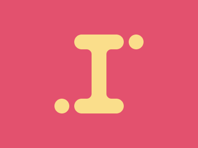    | [View Code](challenges/Battles/21-Rotate/127/index.html)     | [Live Demo](https://ibraheamit.github.io/cssbattle-solutions/challenges/Battles/21-Rotate/127/)     |
| #126   |     | [View Code](challenges/Battles/21-Rotate/126/index.html)     | [Live Demo](https://ibraheamit.github.io/cssbattle-solutions/challenges/Battles/21-Rotate/126/)     |
| #125   |     | [View Code](challenges/Battles/21-Rotate/125/index.html)     | [Live Demo](https://ibraheamit.github.io/cssbattle-solutions/challenges/Battles/21-Rotate/125/)     |
| #124   | 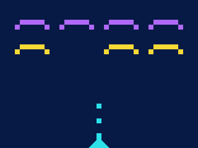     | [View Code](challenges/Battles/20-Hover/124/index.html)      | [Live Demo](https://ibraheamit.github.io/cssbattle-solutions/challenges/Battles/20-Hover/124/)      |
| #123   | 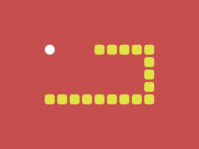     | [View Code](challenges/Battles/20-Hover/123/index.html)      | [Live Demo](https://ibraheamit.github.io/cssbattle-solutions/challenges/Battles/20-Hover/123/)      |
| #122   | 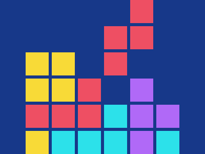     | [View Code](challenges/Battles/20-Hover/122/index.html)      | [Live Demo](https://ibraheamit.github.io/cssbattle-solutions/challenges/Battles/20-Hover/122/)      |
| #121   |      | [View Code](challenges/Battles/20-Hover/121/index.html)      | [Live Demo](https://ibraheamit.github.io/cssbattle-solutions/challenges/Battles/20-Hover/121/)      |
| #120   | 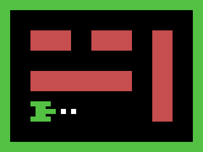     | [View Code](challenges/Battles/20-Hover/120/index.html)      | [Live Demo](https://ibraheamit.github.io/cssbattle-solutions/challenges/Battles/20-Hover/120/)      |
| #119   | 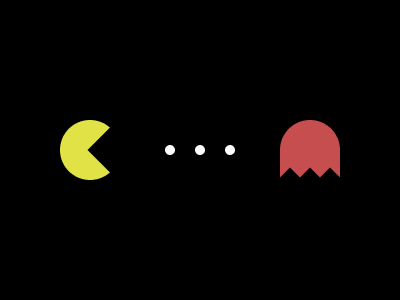     | [View Code](challenges/Battles/20-Hover/119/index.html)      | [Live Demo](https://ibraheamit.github.io/cssbattle-solutions/challenges/Battles/20-Hover/119/)      |
| #118   | 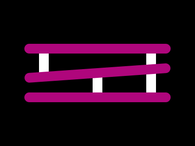     | [View Code](challenges/Battles/20-Hover/118/index.html)      | [Live Demo](https://ibraheamit.github.io/cssbattle-solutions/challenges/Battles/20-Hover/118/)      |
| #117   | 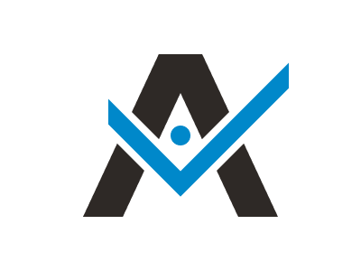     | [View Code](challenges/Battles/20-Hover/117/index.html)      | [Live Demo](https://ibraheamit.github.io/cssbattle-solutions/challenges/Battles/20-Hover/117/)      |
| #116   |    | [View Code](challenges/Battles/19-Spacing/116/index.html)    | [Live Demo](https://ibraheamit.github.io/cssbattle-solutions/challenges/Battles/19-Spacing/116/)    |
| #115   |    | [View Code](challenges/Battles/19-Spacing/115/index.html)    | [Live Demo](https://ibraheamit.github.io/cssbattle-solutions/challenges/Battles/19-Spacing/115/)    |
| #114   |    | [View Code](challenges/Battles/19-Spacing/114/index.html)    | [Live Demo](https://ibraheamit.github.io/cssbattle-solutions/challenges/Battles/19-Spacing/114/)    |
| #113   | 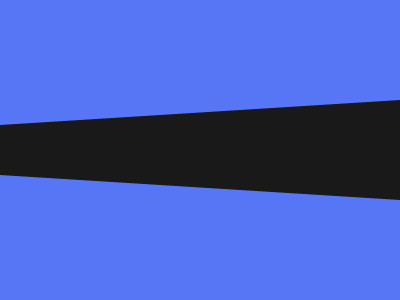   | [View Code](challenges/Battles/19-Spacing/113/index.html)    | [Live Demo](https://ibraheamit.github.io/cssbattle-solutions/challenges/Battles/19-Spacing/113/)    |
| #112   |    | [View Code](challenges/Battles/19-Spacing/112/index.html)    | [Live Demo](https://ibraheamit.github.io/cssbattle-solutions/challenges/Battles/19-Spacing/112/)    |
| #111   |    | [View Code](challenges/Battles/19-Spacing/111/index.html)    | [Live Demo](https://ibraheamit.github.io/cssbattle-solutions/challenges/Battles/19-Spacing/111/)    |
| #110   |    | [View Code](challenges/Battles/19-Spacing/110/index.html)    | [Live Demo](https://ibraheamit.github.io/cssbattle-solutions/challenges/Battles/19-Spacing/110/)    |
| #109   | 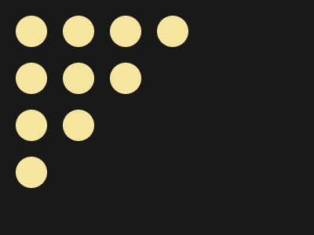   | [View Code](challenges/Battles/19-Spacing/109/index.html)    | [Live Demo](https://ibraheamit.github.io/cssbattle-solutions/challenges/Battles/19-Spacing/109/)    |
| #108   | 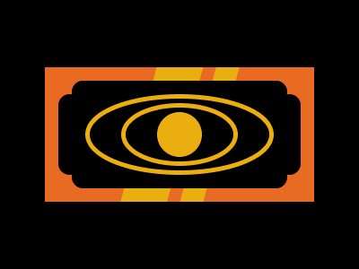     | [View Code](challenges/Battles/18-Float/108/index.html)      | [Live Demo](https://ibraheamit.github.io/cssbattle-solutions/challenges/Battles/18-Float/108/)      |
| #107   |      | [View Code](challenges/Battles/18-Float/107/index.html)      | [Live Demo](https://ibraheamit.github.io/cssbattle-solutions/challenges/Battles/18-Float/107/)      |
| #106   | 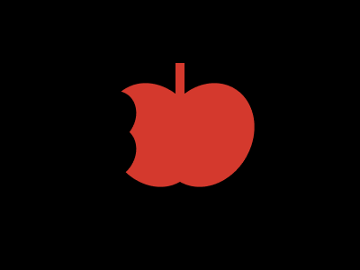     | [View Code](challenges/Battles/18-Float/106/index.html)      | [Live Demo](https://ibraheamit.github.io/cssbattle-solutions/challenges/Battles/18-Float/106/)      |
| #105   | 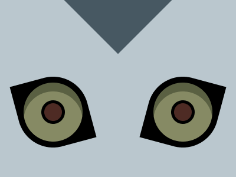     | [View Code](challenges/Battles/18-Float/105/index.html)      | [Live Demo](https://ibraheamit.github.io/cssbattle-solutions/challenges/Battles/18-Float/105/)      |
| #104   | 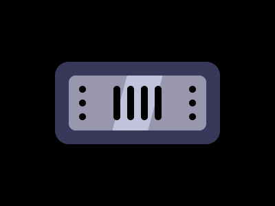     | [View Code](challenges/Battles/18-Float/104/index.html)      | [Live Demo](https://ibraheamit.github.io/cssbattle-solutions/challenges/Battles/18-Float/104/)      |
| #103   |      | [View Code](challenges/Battles/18-Float/103/index.html)      | [Live Demo](https://ibraheamit.github.io/cssbattle-solutions/challenges/Battles/18-Float/103/)      |
| #102   | 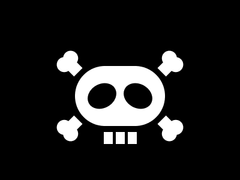     | [View Code](challenges/Battles/18-Float/102/index.html)      | [Live Demo](https://ibraheamit.github.io/cssbattle-solutions/challenges/Battles/18-Float/102/)      |
| #101   | 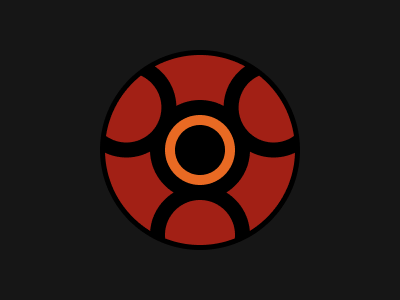     | [View Code](challenges/Battles/18-Float/101/index.html)      | [Live Demo](https://ibraheamit.github.io/cssbattle-solutions/challenges/Battles/18-Float/101/)      |
| #100   | 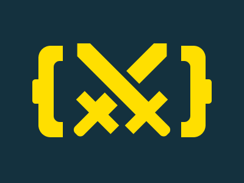 | [View Code](challenges/Battles/17-Christmas/100/index.html)  | [Live Demo](https://ibraheamit.github.io/cssbattle-solutions/challenges/Battles/17-Christmas/100/)  |
| #99    | 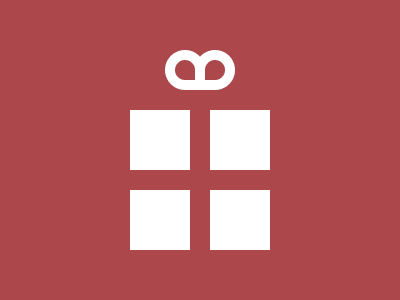   | [View Code](challenges/Battles/17-Christmas/99/index.html)   | [Live Demo](https://ibraheamit.github.io/cssbattle-solutions/challenges/Battles/17-Christmas/99/)   |
| #98    |    | [View Code](challenges/Battles/17-Christmas/98/index.html)   | [Live Demo](https://ibraheamit.github.io/cssbattle-solutions/challenges/Battles/17-Christmas/98/)   |
| #97    |    | [View Code](challenges/Battles/17-Christmas/97/index.html)   | [Live Demo](https://ibraheamit.github.io/cssbattle-solutions/challenges/Battles/17-Christmas/97/)   |
| #96    | 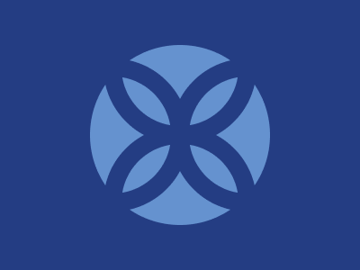      | [View Code](challenges/Battles/16-Aspect/96/index.html)      | [Live Demo](https://ibraheamit.github.io/cssbattle-solutions/challenges/Battles/16-Aspect/96/)      |
| #95    | 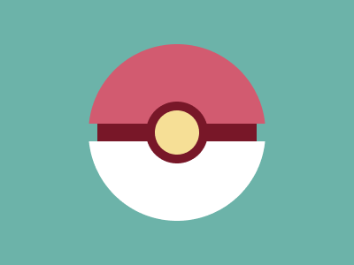      | [View Code](challenges/Battles/16-Aspect/95/index.html)      | [Live Demo](https://ibraheamit.github.io/cssbattle-solutions/challenges/Battles/16-Aspect/95/)      |
| #94    | 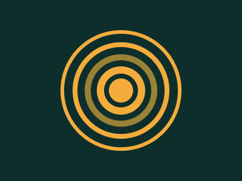      | [View Code](challenges/Battles/16-Aspect/94/index.html)      | [Live Demo](https://ibraheamit.github.io/cssbattle-solutions/challenges/Battles/16-Aspect/94/)      |
| #93    | 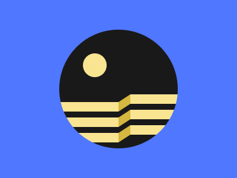      | [View Code](challenges/Battles/16-Aspect/93/index.html)      | [Live Demo](https://ibraheamit.github.io/cssbattle-solutions/challenges/Battles/16-Aspect/93/)      |
| #92    | 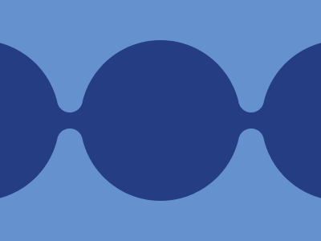      | [View Code](challenges/Battles/16-Aspect/92/index.html)      | [Live Demo](https://ibraheamit.github.io/cssbattle-solutions/challenges/Battles/16-Aspect/92/)      |
| #91    | 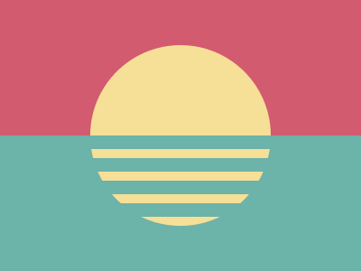      | [View Code](challenges/Battles/16-Aspect/91/index.html)      | [Live Demo](https://ibraheamit.github.io/cssbattle-solutions/challenges/Battles/16-Aspect/91/)      |
| #90    |       | [View Code](challenges/Battles/16-Aspect/90/index.html)      | [Live Demo](https://ibraheamit.github.io/cssbattle-solutions/challenges/Battles/16-Aspect/90/)      |
| #89    | 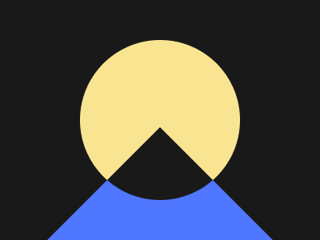      | [View Code](challenges/Battles/16-Aspect/89/index.html)      | [Live Demo](https://ibraheamit.github.io/cssbattle-solutions/challenges/Battles/16-Aspect/89/)      |
| #88    |       | [View Code](challenges/Battles/15-Filter/88/index.html)      | [Live Demo](https://ibraheamit.github.io/cssbattle-solutions/challenges/Battles/15-Filter/88/)      |
| #87    |       | [View Code](challenges/Battles/15-Filter/87/index.html)      | [Live Demo](https://ibraheamit.github.io/cssbattle-solutions/challenges/Battles/15-Filter/87/)      |
| #86    | 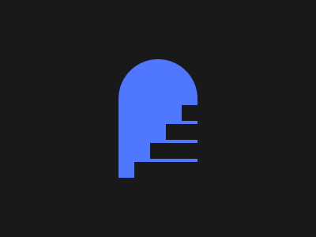      | [View Code](challenges/Battles/15-Filter/86/index.html)      | [Live Demo](https://ibraheamit.github.io/cssbattle-solutions/challenges/Battles/15-Filter/86/)      |
| #85    |       | [View Code](challenges/Battles/15-Filter/85/index.html)      | [Live Demo](https://ibraheamit.github.io/cssbattle-solutions/challenges/Battles/15-Filter/85/)      |
| #84    | 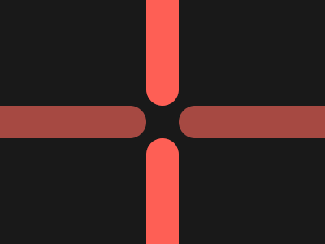      | [View Code](challenges/Battles/15-Filter/84/index.html)      | [Live Demo](https://ibraheamit.github.io/cssbattle-solutions/challenges/Battles/15-Filter/84/)      |
| #83    | 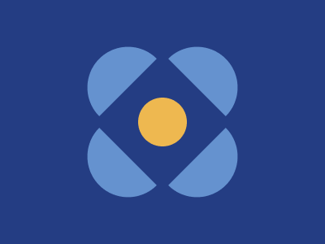      | [View Code](challenges/Battles/15-Filter/83/index.html)      | [Live Demo](https://ibraheamit.github.io/cssbattle-solutions/challenges/Battles/15-Filter/83/)      |
| #82    |       | [View Code](challenges/Battles/15-Filter/82/index.html)      | [Live Demo](https://ibraheamit.github.io/cssbattle-solutions/challenges/Battles/15-Filter/82/)      |
| #81    |       | [View Code](challenges/Battles/15-Filter/81/index.html)      | [Live Demo](https://ibraheamit.github.io/cssbattle-solutions/challenges/Battles/15-Filter/81/)      |
| #80    | 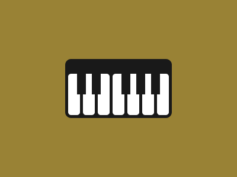      | [View Code](challenges/Battles/14-ZIndex/80/index.html)      | [Live Demo](https://ibraheamit.github.io/cssbattle-solutions/challenges/Battles/14-ZIndex/80/)      |
| #79    | 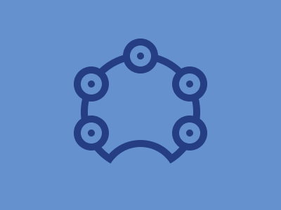      | [View Code](challenges/Battles/14-ZIndex/79/index.html)      | [Live Demo](https://ibraheamit.github.io/cssbattle-solutions/challenges/Battles/14-ZIndex/79/)      |
| #78    | 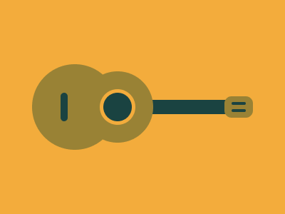      | [View Code](challenges/Battles/14-ZIndex/78/index.html)      | [Live Demo](https://ibraheamit.github.io/cssbattle-solutions/challenges/Battles/14-ZIndex/78/)      |
| #77    |       | [View Code](challenges/Battles/14-ZIndex/77/index.html)      | [Live Demo](https://ibraheamit.github.io/cssbattle-solutions/challenges/Battles/14-ZIndex/77/)      |
| #76    | 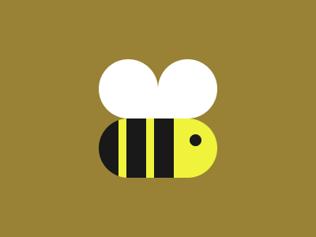        | [View Code](challenges/Battles/13-Clip/76/index.html)        | [Live Demo](https://ibraheamit.github.io/cssbattle-solutions/challenges/Battles/13-Clip/76/)        |
| #75    | 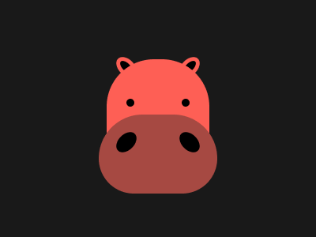        | [View Code](challenges/Battles/13-Clip/75/index.html)        | [Live Demo](https://ibraheamit.github.io/cssbattle-solutions/challenges/Battles/13-Clip/75/)        |
| #74    | 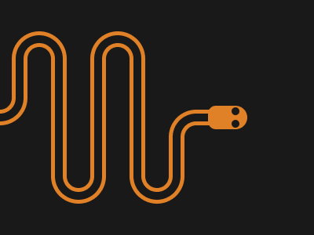        | [View Code](challenges/Battles/13-Clip/74/index.html)        | [Live Demo](https://ibraheamit.github.io/cssbattle-solutions/challenges/Battles/13-Clip/74/)        |
| #73    |         | [View Code](challenges/Battles/13-Clip/73/index.html)        | [Live Demo](https://ibraheamit.github.io/cssbattle-solutions/challenges/Battles/13-Clip/73/)        |
| #72    | 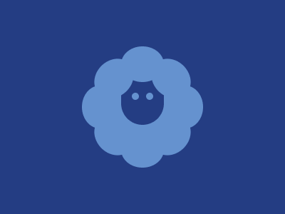        | [View Code](challenges/Battles/13-Clip/72/index.html)        | [Live Demo](https://ibraheamit.github.io/cssbattle-solutions/challenges/Battles/13-Clip/72/)        |
| #71    |         | [View Code](challenges/Battles/13-Clip/71/index.html)        | [Live Demo](https://ibraheamit.github.io/cssbattle-solutions/challenges/Battles/13-Clip/71/)        |
| #70    |         | [View Code](challenges/Battles/13-Clip/70/index.html)        | [Live Demo](https://ibraheamit.github.io/cssbattle-solutions/challenges/Battles/13-Clip/70/)        |
| #69    |         | [View Code](challenges/Battles/13-Clip/69/index.html)        | [Live Demo](https://ibraheamit.github.io/cssbattle-solutions/challenges/Battles/13-Clip/69/)        |
| #68    |        | [View Code](challenges/Battles/12-Blend/68/index.html)       | [Live Demo](https://ibraheamit.github.io/cssbattle-solutions/challenges/Battles/12-Blend/68/)       |
| #67    | 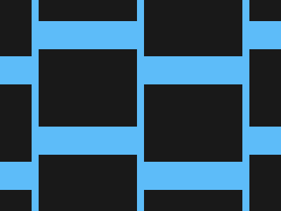       | [View Code](challenges/Battles/12-Blend/67/index.html)       | [Live Demo](https://ibraheamit.github.io/cssbattle-solutions/challenges/Battles/12-Blend/67/)       |
| #66    | 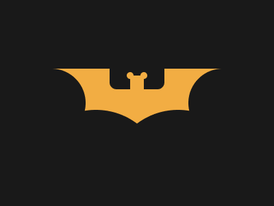       | [View Code](challenges/Battles/12-Blend/66/index.html)       | [Live Demo](https://ibraheamit.github.io/cssbattle-solutions/challenges/Battles/12-Blend/66/)       |
| #65    |        | [View Code](challenges/Battles/12-Blend/65/index.html)       | [Live Demo](https://ibraheamit.github.io/cssbattle-solutions/challenges/Battles/12-Blend/65/)       |
| #64    |        | [View Code](challenges/Battles/12-Blend/64/index.html)       | [Live Demo](https://ibraheamit.github.io/cssbattle-solutions/challenges/Battles/12-Blend/64/)       |
| #63    |        | [View Code](challenges/Battles/12-Blend/63/index.html)       | [Live Demo](https://ibraheamit.github.io/cssbattle-solutions/challenges/Battles/12-Blend/63/)       |
| #62    |        | [View Code](challenges/Battles/12-Blend/62/index.html)       | [Live Demo](https://ibraheamit.github.io/cssbattle-solutions/challenges/Battles/12-Blend/62/)       |
| #61    |        | [View Code](challenges/Battles/12-Blend/61/index.html)       | [Live Demo](https://ibraheamit.github.io/cssbattle-solutions/challenges/Battles/12-Blend/61/)       |
| #60    |     | [View Code](challenges/Battles/11-Overflow/60/index.html)    | [Live Demo](https://ibraheamit.github.io/cssbattle-solutions/challenges/Battles/11-Overflow/60/)    |
| #59    |     | [View Code](challenges/Battles/11-Overflow/59/index.html)    | [Live Demo](https://ibraheamit.github.io/cssbattle-solutions/challenges/Battles/11-Overflow/59/)    |
| #58    |     | [View Code](challenges/Battles/11-Overflow/58/index.html)    | [Live Demo](https://ibraheamit.github.io/cssbattle-solutions/challenges/Battles/11-Overflow/58/)    |
| #57    |     | [View Code](challenges/Battles/11-Overflow/57/index.html)    | [Live Demo](https://ibraheamit.github.io/cssbattle-solutions/challenges/Battles/11-Overflow/57/)    |
| #56    |     | [View Code](challenges/Battles/11-Overflow/56/index.html)    | [Live Demo](https://ibraheamit.github.io/cssbattle-solutions/challenges/Battles/11-Overflow/56/)    |
| #55    |     | [View Code](challenges/Battles/11-Overflow/55/index.html)    | [Live Demo](https://ibraheamit.github.io/cssbattle-solutions/challenges/Battles/11-Overflow/55/)    |
| #54    |     | [View Code](challenges/Battles/11-Overflow/54/index.html)    | [Live Demo](https://ibraheamit.github.io/cssbattle-solutions/challenges/Battles/11-Overflow/54/)    |
| #53    |     | [View Code](challenges/Battles/11-Overflow/53/index.html)    | [Live Demo](https://ibraheamit.github.io/cssbattle-solutions/challenges/Battles/11-Overflow/53/)    |
| #52    |        | [View Code](challenges/Battles/10-Block/52/index.html)       | [Live Demo](https://ibraheamit.github.io/cssbattle-solutions/challenges/Battles/10-Block/52/)       |
| #51    |        | [View Code](challenges/Battles/10-Block/51/index.html)       | [Live Demo](https://ibraheamit.github.io/cssbattle-solutions/challenges/Battles/10-Block/51/)       |
| #50    |        | [View Code](challenges/Battles/10-Block/50/index.html)       | [Live Demo](https://ibraheamit.github.io/cssbattle-solutions/challenges/Battles/10-Block/50/)       |
| #49    |        | [View Code](challenges/Battles/10-Block/49/index.html)       | [Live Demo](https://ibraheamit.github.io/cssbattle-solutions/challenges/Battles/10-Block/49/)       |
| #48    |        | [View Code](challenges/Battles/10-Block/48/index.html)       | [Live Demo](https://ibraheamit.github.io/cssbattle-solutions/challenges/Battles/10-Block/48/)       |
| #47    |        | [View Code](challenges/Battles/10-Block/47/index.html)       | [Live Demo](https://ibraheamit.github.io/cssbattle-solutions/challenges/Battles/10-Block/47/)       |
| #46    |        | [View Code](challenges/Battles/9-Margin/46/index.html)       | [Live Demo](https://ibraheamit.github.io/cssbattle-solutions/challenges/Battles/9-Margin/46/)       |
| #45    |        | [View Code](challenges/Battles/9-Margin/45/index.html)       | [Live Demo](https://ibraheamit.github.io/cssbattle-solutions/challenges/Battles/9-Margin/45/)       |
| #44    |    | [View Code](challenges/Battles/8-Transition/44/index.html)   | [Live Demo](https://ibraheamit.github.io/cssbattle-solutions/challenges/Battles/8-Transition/44/)   |
| #43    |    | [View Code](challenges/Battles/8-Transition/43/index.html)   | [Live Demo](https://ibraheamit.github.io/cssbattle-solutions/challenges/Battles/8-Transition/43/)   |
| #42    |    | [View Code](challenges/Battles/8-Transition/42/index.html)   | [Live Demo](https://ibraheamit.github.io/cssbattle-solutions/challenges/Battles/8-Transition/42/)   |
| #41    |      | [View Code](challenges/Battles/7-Backface/41/index.html)     | [Live Demo](https://ibraheamit.github.io/cssbattle-solutions/challenges/Battles/7-Backface/41/)     |
| #40    |      | [View Code](challenges/Battles/7-Backface/40/index.html)     | [Live Demo](https://ibraheamit.github.io/cssbattle-solutions/challenges/Battles/7-Backface/40/)     |
| #39    |      | [View Code](challenges/Battles/7-Backface/39/index.html)     | [Live Demo](https://ibraheamit.github.io/cssbattle-solutions/challenges/Battles/7-Backface/39/)     |
| #38    |      | [View Code](challenges/Battles/7-Backface/38/index.html)     | [Live Demo](https://ibraheamit.github.io/cssbattle-solutions/challenges/Battles/7-Backface/38/)     |
| #37    |      | [View Code](challenges/Battles/7-Backface/37/index.html)     | [Live Demo](https://ibraheamit.github.io/cssbattle-solutions/challenges/Battles/7-Backface/37/)     |
| #36    |      | [View Code](challenges/Battles/7-Backface/36/index.html)     | [Live Demo](https://ibraheamit.github.io/cssbattle-solutions/challenges/Battles/7-Backface/36/)     |
| #35    |      | [View Code](challenges/Battles/7-Backface/35/index.html)     | [Live Demo](https://ibraheamit.github.io/cssbattle-solutions/challenges/Battles/7-Backface/35/)     |
| #34    |      | [View Code](challenges/Battles/7-Backface/34/index.html)     | [Live Demo](https://ibraheamit.github.io/cssbattle-solutions/challenges/Battles/7-Backface/34/)     |
| #33    |      | [View Code](challenges/Battles/7-Backface/33/index.html)     | [Live Demo](https://ibraheamit.github.io/cssbattle-solutions/challenges/Battles/7-Backface/33/)     |
| #32    |         | [View Code](challenges/Battles/6-Conic/32/index.html)        | [Live Demo](https://ibraheamit.github.io/cssbattle-solutions/challenges/Battles/6-Conic/32/)        |
| #31    |         | [View Code](challenges/Battles/6-Conic/31/index.html)        | [Live Demo](https://ibraheamit.github.io/cssbattle-solutions/challenges/Battles/6-Conic/31/)        |
| #30    |        | [View Code](challenges/Battles/5-Inline/30/index.html)       | [Live Demo](https://ibraheamit.github.io/cssbattle-solutions/challenges/Battles/5-Inline/30/)       |
| #29    |        | [View Code](challenges/Battles/5-Inline/29/index.html)       | [Live Demo](https://ibraheamit.github.io/cssbattle-solutions/challenges/Battles/5-Inline/29/)       |
| #28    |       | [View Code](challenges/Battles/4-Display/28/index.html)      | [Live Demo](https://ibraheamit.github.io/cssbattle-solutions/challenges/Battles/4-Display/28/)      |
| #27    |       | [View Code](challenges/Battles/4-Display/27/index.html)      | [Live Demo](https://ibraheamit.github.io/cssbattle-solutions/challenges/Battles/4-Display/27/)      |
| #26    |       | [View Code](challenges/Battles/4-Display/26/index.html)      | [Live Demo](https://ibraheamit.github.io/cssbattle-solutions/challenges/Battles/4-Display/26/)      |
| #25    |       | [View Code](challenges/Battles/4-Display/25/index.html)      | [Live Demo](https://ibraheamit.github.io/cssbattle-solutions/challenges/Battles/4-Display/25/)      |
| #24    |       | [View Code](challenges/Battles/4-Display/24/index.html)      | [Live Demo](https://ibraheamit.github.io/cssbattle-solutions/challenges/Battles/4-Display/24/)      |
| #23    |       | [View Code](challenges/Battles/4-Display/23/index.html)      | [Live Demo](https://ibraheamit.github.io/cssbattle-solutions/challenges/Battles/4-Display/23/)      |
| #22    |       | [View Code](challenges/Battles/4-Display/22/index.html)      | [Live Demo](https://ibraheamit.github.io/cssbattle-solutions/challenges/Battles/4-Display/22/)      |
| #21    |       | [View Code](challenges/Battles/4-Display/21/index.html)      | [Live Demo](https://ibraheamit.github.io/cssbattle-solutions/challenges/Battles/4-Display/21/)      |
| #20    |        | [View Code](challenges/Battles/3-Cursor/20/index.html)       | [Live Demo](https://ibraheamit.github.io/cssbattle-solutions/challenges/Battles/3-Cursor/20/)       |
| #19    |        | [View Code](challenges/Battles/3-Cursor/19/index.html)       | [Live Demo](https://ibraheamit.github.io/cssbattle-solutions/challenges/Battles/3-Cursor/19/)       |
| #18    |    | [View Code](challenges/Battles/2-Visibility/18/index.html)   | [Live Demo](https://ibraheamit.github.io/cssbattle-solutions/challenges/Battles/2-Visibility/18/)   |
| #17    |    | [View Code](challenges/Battles/2-Visibility/17/index.html)   | [Live Demo](https://ibraheamit.github.io/cssbattle-solutions/challenges/Battles/2-Visibility/17/)   |
| #16    |    | [View Code](challenges/Battles/2-Visibility/16/index.html)   | [Live Demo](http://ibraheamit.github.io/cssbattle-solutions/challenges/Battles/2-Visibility/16/)    |
| #15    |    | [View Code](challenges/Battles/2-Visibility/15/index.html)   | [Live Demo](http://ibraheamit.github.io/cssbattle-solutions/challenges/Battles/2-Visibility/15/)    |
| #14    |    | [View Code](challenges/Battles/2-Visibility/14/index.html)   | [Live Demo](https://ibraheamit.github.io/cssbattle-solutions/challenges/Battles/2-Visibility/14/)   |
| #13    |    | [View Code](challenges/Battles/2-Visibility/13/index.html)   | [Live Demo](https://ibraheamit.github.io/cssbattle-solutions/challenges/Battles/2-Visibility/13/)   |
| #12    |  | [View Code](challenges/Battles/1-Pilot-Battle/12/index.html) | [Live Demo](https://ibraheamit.github.io/cssbattle-solutions/challenges/Battles/1-Pilot-Battle/12/) |
| #11    |  | [View Code](challenges/Battles/1-Pilot-Battle/11/index.html) | [Live Demo](https://ibraheamit.github.io/cssbattle-solutions/challenges/Battles/1-Pilot-Battle/11/) |
| #10    |  | [View Code](challenges/Battles/1-Pilot-Battle/10/index.html) | [Live Demo](https://ibraheamit.github.io/cssbattle-solutions/challenges/Battles/1-Pilot-Battle/10/) |
| #9     |    | [View Code](challenges/Battles/1-Pilot-Battle/9/index.html)  | [Live Demo](https://ibraheamit.github.io/cssbattle-solutions/challenges/Battles/1-Pilot-Battle/9/)  |
| #8     |    | [View Code](challenges/Battles/1-Pilot-Battle/8/index.html)  | [Live Demo](https://ibraheamit.github.io/cssbattle-solutions/challenges/Battles/1-Pilot-Battle/8/)  |
| #7     |    | [View Code](challenges/Battles/1-Pilot-Battle/7/index.html)  | [Live Demo](https://ibraheamit.github.io/cssbattle-solutions/challenges/Battles/1-Pilot-Battle/7/)  |
| #6     |    | [View Code](challenges/Battles/1-Pilot-Battle/6/index.html)  | [Live Demo](https://ibraheamit.github.io/cssbattle-solutions/challenges/Battles/1-Pilot-Battle/6/)  |
| #5     |    | [View Code](challenges/Battles/1-Pilot-Battle/5/index.html)  | [Live Demo](https://ibraheamit.github.io/cssbattle-solutions/challenges/Battles/1-Pilot-Battle/5/)  |
| #4     |    | [View Code](challenges/Battles/1-Pilot-Battle/4/index.html)  | [Live Demo](https://ibraheamit.github.io/cssbattle-solutions/challenges/Battles/1-Pilot-Battle/4/)  |
| #3     |    | [View Code](challenges/Battles/1-Pilot-Battle/3/index.html)  | [Live Demo](https://ibraheamit.github.io/cssbattle-solutions/challenges/Battles/1-Pilot-Battle/3/)  |
| #2     |    | [View Code](challenges/Battles/1-Pilot-Battle/2/index.html)  | [Live Demo](https://ibraheamit.github.io/cssbattle-solutions/challenges/Battles/1-Pilot-Battle/2/)  |
| #1     |    | [View Code](challenges/Battles/1-Pilot-Battle/1/index.html)  | [Live Demo](https://ibraheamit.github.io/cssbattle-solutions/challenges/Battles/1-Pilot-Battle/1/)  |

---

## 💡 Tips to Get a High Score in CSSBattle

- 🔹 **Minimize your code**: The shorter your code, the higher your score.
- 🔹 **Use smart CSS properties**: e.g., `background`, `linear-gradient`, and `box-shadow` can save a lot of lines.
- 🔹 **Leverage relative units**: `%`, `em`, `vw/vh` often reduce code complexity.
- 🔹 **Refactor instead of rewriting**: Start with a working solution, then simplify.
- 🔹 **Use browser DevTools**: Adjust values live to speed up the process.
- 🔹 **Practice old battles**: It builds your pattern recognition and speed.
- 🔹 **Prioritize accuracy (Match %)** first, then optimize for Golf Score.

---

## 🚀 How to View

- Open any challenge folder and run `index.html` in your browser.
- Or click on **Live Demo** in the table above to preview directly.

---
