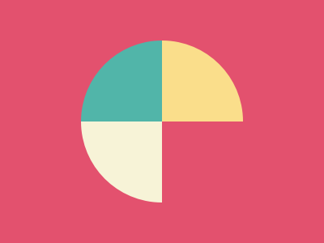
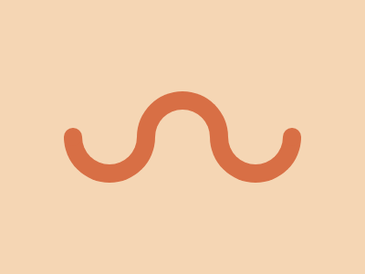

# 🎨 CSSBattle Solutions

This repository contains all my solutions for [CSSBattle](https://cssbattle.dev/) challenges.  
I will keep updating it with new challenges regularly. ✨

### Follow me on

🔗 CSSBattle: [ibrahimit](https://cssbattle.dev/player/ibrahimit)  
🔗 My GitHub: [ibraheamit](https://github.com/ibraheamit)
🔗 My LinkedIn: [ibraheamit](https://www.linkedin.com/in/ibraheamit/)

---

## 🏆 Challenges

### 📅 Daily targets

| Date       | Preview                                         | Code                                          | Live Demo                                                                            |
| ---------- | ----------------------------------------------- | --------------------------------------------- | ------------------------------------------------------------------------------------ |
| 2025-09-15 |  | [View Code](challenges/2025-09-15/index.html) | [Live Demo](https://ibraheamit.github.io/cssbattle-solutions/challenges/2025-09-15/) |
| 2025-09-16 |  | [View Code](challenges/2025-09-16/index.html) | [Live Demo](https://ibraheamit.github.io/cssbattle-solutions/challenges/2025-09-16/) |
| 2025-09-17 |  | [View Code](challenges/2025-09-17/index.html) | [Live Demo](https://ibraheamit.github.io/cssbattle-solutions/challenges/2025-09-17/) |
| 2025-09-18 |  | [View Code](challenges/2025-09-18/index.html) | [Live Demo](https://ibraheamit.github.io/cssbattle-solutions/challenges/2025-09-18/) |
| 2025-09-19 |  | [View Code](challenges/2025-09-19/index.html) | [Live Demo](https://ibraheamit.github.io/cssbattle-solutions/challenges/2025-09-19/) |
| 2025-09-20 |  | [View Code](challenges/2025-09-20/index.html) | [Live Demo](https://ibraheamit.github.io/cssbattle-solutions/challenges/2025-09-20/) |
| 2025-09-21 |  | [View Code](challenges/2025-09-21/index.html) | [Live Demo](https://ibraheamit.github.io/cssbattle-solutions/challenges/2025-09-21/) |
| 2025-09-22 |  | [View Code](challenges/2025-09-22/index.html) | [Live Demo](https://ibraheamit.github.io/cssbattle-solutions/challenges/2025-09-22/) |
| 2025-09-23 |  | [View Code](challenges/2025-09-23/index.html) | [Live Demo](https://ibraheamit.github.io/cssbattle-solutions/challenges/2025-09-23/) |
| 2025-09-24 |  | [View Code](challenges/2025-09-24/index.html) | [Live Demo](https://ibraheamit.github.io/cssbattle-solutions/challenges/2025-09-24/) |
| 2025-09-25 |  | [View Code](challenges/2025-09-25/index.html) | [live Demo](https://ibraheamit.github.io/cssbattle-solutions/challenges/2025-09-25/) |
| 2025-09-26 |  | [View Code](challenges/2025-09-26/index.html) | [Live Demo](https://ibraheamit.github.io/cssbattle-solutions/challenges/2025-09-26/) |
| 2025-09-27 |  | [View Code](challenges/2025-09-27/index.html) | [Live Demo](https://ibraheamit.github.io/cssbattle-solutions/challenges/2025-09-27/) |
| 2025-09-28 |  | [View Code](challenges/2025-09-28/index.html) | [Live Demo](https://ibraheamit.github.io/cssbattle-solutions/challenges/2025-09-28/) |
| 2025-09-29 |  | [View Code](challenges/2025-09-29/index.html) | [Live Demo](https://ibraheamit.github.io/cssbattle-solutions/challenges/2025-09-29/) |
| 2025-09-30 |  | [View Code](challenges/2025-09-30/index.html) | [Live Demo](https://ibraheamit.github.io/cssbattle-solutions/challenges/2025-09-30/) |
| 2025-10-1  |   | [View Code](challenges/2025-10-1/index.html)  | [Live Demo](https://ibraheamit.github.io/cssbattle-solutions/challenges/2025-10-1/)  |
| 2025-10-2  |   | [View Code](challenges/2025-10-2/index.html)  | [Live Demo](https://ibraheamit.github.io/cssbattle-solutions/challenges/2025-10-2/)  |
| 2025-10-3  |   | [View Code](challenges/2025-10-3/index.html)  | [Live Demo](https://ibraheamit.github.io/cssbattle-solutions/challenges/2025-10-3/)  |

### ⚔️ Battles

| Number | Preview                                                   | Code                                                         | Live Demo                                                                                           |
| ------ | --------------------------------------------------------- | ------------------------------------------------------------ | --------------------------------------------------------------------------------------------------- |
| #1     |    | [View Code](challenges/Battles/1-Pilot-Battle/1/index.html)  | [Live Demo](https://ibraheamit.github.io/cssbattle-solutions/challenges/Battles/1-Pilot-Battle/1/)  |
| #2     |    | [View Code](challenges/Battles/1-Pilot-Battle/2/index.html)  | [Live Demo](https://ibraheamit.github.io/cssbattle-solutions/challenges/Battles/1-Pilot-Battle/2/)  |
| #3     |    | [View Code](challenges/Battles/1-Pilot-Battle/3/index.html)  | [Live Demo](https://ibraheamit.github.io/cssbattle-solutions/challenges/Battles/1-Pilot-Battle/3/)  |
| #4     |    | [View Code](challenges/Battles/1-Pilot-Battle/4/index.html)  | [Live Demo](https://ibraheamit.github.io/cssbattle-solutions/challenges/Battles/1-Pilot-Battle/4/)  |
| #5     |    | [View Code](challenges/Battles/1-Pilot-Battle/5/index.html)  | [Live Demo](https://ibraheamit.github.io/cssbattle-solutions/challenges/Battles/1-Pilot-Battle/5/)  |
| #6     |    | [View Code](challenges/Battles/1-Pilot-Battle/6/index.html)  | [Live Demo](https://ibraheamit.github.io/cssbattle-solutions/challenges/Battles/1-Pilot-Battle/6/)  |
| #7     |    | [View Code](challenges/Battles/1-Pilot-Battle/7/index.html)  | [Live Demo](https://ibraheamit.github.io/cssbattle-solutions/challenges/Battles/1-Pilot-Battle/7/)  |
| #8     |    | [View Code](challenges/Battles/1-Pilot-Battle/8/index.html)  | [Live Demo](https://ibraheamit.github.io/cssbattle-solutions/challenges/Battles/1-Pilot-Battle/8/)  |
| #9     |    | [View Code](challenges/Battles/1-Pilot-Battle/9/index.html)  | [Live Demo](https://ibraheamit.github.io/cssbattle-solutions/challenges/Battles/1-Pilot-Battle/9/)  |
| #10    |  | [View Code](challenges/Battles/1-Pilot-Battle/10/index.html) | [Live Demo](https://ibraheamit.github.io/cssbattle-solutions/challenges/Battles/1-Pilot-Battle/10/) |
| #11    |  | [View Code](challenges/Battles/1-Pilot-Battle/11/index.html) | [Live Demo](https://ibraheamit.github.io/cssbattle-solutions/challenges/Battles/1-Pilot-Battle/11/) |
| #12    |  | [View Code](challenges/Battles/1-Pilot-Battle/12/index.html) | [Live Demo](https://ibraheamit.github.io/cssbattle-solutions/challenges/Battles/1-Pilot-Battle/12/) |
| #13    |    | [View Code](challenges/Battles/2-Visibility/13/index.html)   | [Live Demo](https://ibraheamit.github.io/cssbattle-solutions/challenges/Battles/2-Visibility/13/)   |
| #14    |    | [View Code](challenges/Battles/2-Visibility/14/index.html)   | [Live Demo](https://ibraheamit.github.io/cssbattle-solutions/challenges/Battles/2-Visibility/14/)   |
| #15    |    | [View Code](challenges/Battles/2-Visibility/15/index.html)   | [Live Demo](http://ibraheamit.github.io/cssbattle-solutions/challenges/Battles/2-Visibility/15/)    |
| #16    |    | [View Code](challenges/Battles/2-Visibility/16/index.html)   | [Live Demo](http://ibraheamit.github.io/cssbattle-solutions/challenges/Battles/2-Visibility/16/)    |
| #17    |    | [View Code](challenges/Battles/2-Visibility/17/index.html)   | [Live Demo](https://ibraheamit.github.io/cssbattle-solutions/challenges/Battles/2-Visibility/17/)   |
| #18    |    | [View Code](challenges/Battles/2-Visibility/18/index.html)   | [Live Demo](https://ibraheamit.github.io/cssbattle-solutions/challenges/Battles/2-Visibility/18/)   |

---

## 💡 Tips to Get a High Score in CSSBattle

- 🔹 **Minimize your code**: The shorter your code, the higher your score.
- 🔹 **Use smart CSS properties**: e.g., `background`, `linear-gradient`, and `box-shadow` can save a lot of lines.
- 🔹 **Leverage relative units**: `%`, `em`, `vw/vh` often reduce code complexity.
- 🔹 **Refactor instead of rewriting**: Start with a working solution, then simplify.
- 🔹 **Use browser DevTools**: Adjust values live to speed up the process.
- 🔹 **Practice old battles**: It builds your pattern recognition and speed.
- 🔹 **Prioritize accuracy (Match %)** first, then optimize for Golf Score.

---

## 🚀 How to View

- Open any challenge folder and run `index.html` in your browser.
- Or click on **Live Demo** in the table above to preview directly.

---
